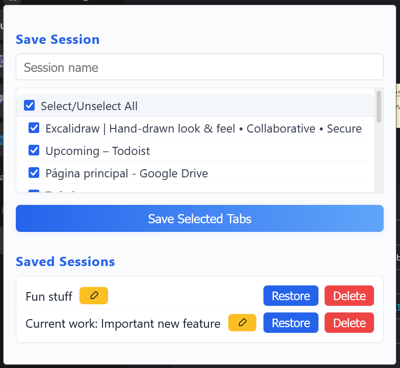

# Session Saver :floppy_disk:

**Session Saver** is a simple, cross-browser extension for Chrome and Firefox that allows you to:
- Save and restore multiple browsing sessions.
- Choose which URLs to include in each saved session.
- Easily select or unselect all tabs before saving.
- Rename your saved sessions directly from the list.
- Manage your sessions with a clean and modern popup interface.
- Import/export sessions via a JSON file.

## Preview



## Features

- **Save Current Tabs:** Select which open tabs you want to save to a named session.
- **Restore Sessions:** Open all URLs from a saved session in new tabs.
- **Delete Sessions:** Remove sessions you no longer need.
- **Rename Sessions:** Edit a session name from the session list using the pencil button, then press Enter or the checkmark to save.
- **Select/Unselect All:** Quickly select or deselect all tabs with one click.
- **Modern UI:** Clean, responsive popup with polished styles.
- **Import/export Sessions:** Export your session data as a backup (`sessions-backup.json`) and import it later via the Options page (click ⚙️ Options in the popup).


## Installation on Chrome / Firefox (Manual)

1. Clone or download this repository.
2. (Optional) If you're using a custom SVG, convert `icon.svg` to `icon16.png`, `icon48.png`, and `icon128.png` (see [Icons](#icons)).
3. Open your browser's extension management page:
   - **Chrome:** `chrome://extensions/`
   - **Firefox:** `about:debugging#/runtime/this-firefox`
4. Enable "Developer mode" or "Load Temporary Add-on".
5. Click "Load unpacked" (Chrome) or "Load Temporary Add-on" (Firefox), then select the extension folder.


## Usage

1. Click the Session Saver icon in your browser toolbar.
2. Enter a session name.
3. Use the checkboxes (or "Select/Unselect All") to choose which tabs to save.
4. Click **Save Selected Tabs**.
5. Restore, rename, or delete saved sessions from the list below:
   - Click the pencil (✏️) button next to a session name to rename it.
   - Edit the name, then press Enter or the checkmark (✔️) button to save. Press Esc or the X to cancel.

## File Structure

```
/
├── popup.html         # Popup UI
├── popup.js           # Popup logic
├── manifest.json      # Extension manifest
├── icons              # Icons folder
    ├── icon.svg           # Source logo (SVG, not used directly in manifest)
    ├── icon16.png         # 16x16 icon (used in browser toolbar)
    ├── icon48.png         # 48x48 icon
    ├── icon128.png        # 128x128 icon (used in Chrome Web Store, etc)
```


## Icons

Browser extensions require PNG icons. If you need to convert `icon.svg` to PNGs:

**With Inkscape:**
```sh
inkscape -w 16 -h 16 icons/icon.svg -o icons/icon16.png
inkscape -w 48 -h 48 icons/icon.svg -o icons/icon48.png
inkscape -w 128 -h 128 icons/icon.svg -o icons/icon128.png
```

**With ImageMagick:**
```sh
convert -background none -resize 16x16 icons/icon.svg icons/icon16.png
convert -background none -resize 48x48 icons/icon.svg icons/icon48.png
convert -background none -resize 128x128 icons/icon.svg icons/icon128.png
```

Or use any vector editor (e.g., Figma, Illustrator) to export the PNGs.

Add these PNGs to your project root.


## `manifest.json` content

```json
{
    "manifest_version": 3,
    "name": "Session Saver",
    "version": "1.0",
    "description": "Save and restore multiple tab sessions, choosing which URLs to include.",
    "permissions":
    [
        "tabs",
        "storage"
    ],
    "action":
    {
        "default_popup": "popup.html",
        "default_icon":
        {
            "16": "icons/icon16.png",
            "48": "icons/icon48.png",
            "128": "icons/icon128.png"
        }
    },
    "options_page": "options.html",
    "icons":
    {
        "16": "icons/icon16.png",
        "48": "icons/icon48.png",
        "128": "icons/icon128.png"
    },
    "browser_specific_settings":
    {
        "gecko":
        {
            "id": "aaossa.dev@gmail.com"
        }
    }
}
```

---

> [!NOTE]
> This code was developed with the assistance of AI:
>
> - **Model:** GPT-4.1
> - **Platform:** GitHub Copilot at GitHub.com
> - **How it was used:** Generation of initial versions of all source files (`manifest.json`, `popup.html`, `popup.js`, `icon.svg`, `README.md`)


## Contributing

Pull requests and suggestions are welcome! Please open an issue to discuss your idea or submit a PR.


## License

[MIT](LICENSE)
